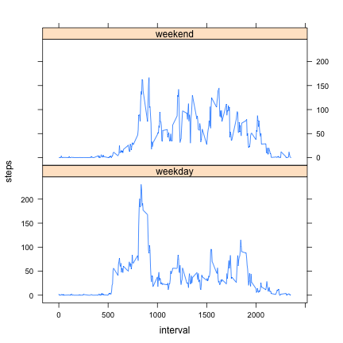

# Reproducible Research: Peer Assessment 1


## Loading and preprocessing the data

First include packages, read in the CSV file, and finally convert it to a data table.


```r
library(data.table);
library(plyr);
library(lattice)
data = read.csv("activity.csv");
data = data.table(data);
```

## What is mean total number of steps taken per day?

We get a data table with the sum of the steps for each day and properly label the columns.
Using that table, we can calculate the daily mean and daily median values.


```r
daily = data[, sum(steps, na.rm = TRUE), by = date];
setnames(daily, 'V1', 'steps');
daily_mean = mean(daily$steps);
daily_median = median(daily$steps); 
```


```r
with(daily, hist(steps,
	main = "Frequency of total steps per day",
	xlab = "Total steps per day"
));
```

 


```r
print(paste("Mean total number of steps per day: ", daily_mean));
```

```
## [1] "Mean total number of steps per day:  9354.22950819672"
```

```r
print(paste("Median total number of steps per day: ", daily_median));
```

```
## [1] "Median total number of steps per day:  10395"
```

## What is the average daily activity pattern?

Here we get the mean of the steps for each interval and give that table nicer column names.
We also find the interval with the highest mean number of steps.


```r
intervally = data[, mean(steps, na.rm = TRUE), by = interval];
setnames(intervally, 'V1', 'steps');
max_interval = intervally[which.max(intervally$steps), interval];
```


```r
with(intervally, plot(interval, steps, type = "l",
	main = "Average number of steps per interval",
	xlab = "Interval",
	ylab = "Average number of steps"
));
```

 


```r
print(paste("Interval with maximum average steps: ", max_interval));
```

```
## [1] "Interval with maximum average steps:  835"
```

## Imputing missing values

How many NAs are there?


```r
num_na = length(data[is.na(data$steps)]$steps);
print(paste("There are ", num_na, " missing values for steps"));
```

```
## [1] "There are  2304  missing values for steps"
```

Let's make a new data table with the missing NAs filled in with the average of the interval


```r
impute_mean = function(x) replace(x, is.na(x), round(mean(x, na.rm = TRUE)));
filled = ddply(data, ~ interval, transform, steps = impute_mean(steps));
filled = data.table(filled);
```

Use this data to generate the daily data and the relevent histogram, mean, and median.


```r
fdaily = filled[, sum(steps, na.rm = TRUE), by = date];
setnames(fdaily, 'V1', 'steps');
fdaily_mean = mean(fdaily$steps);
fdaily_median = median(fdaily$steps); 
```


```r
with(fdaily, hist(steps,
	main = "Frequency of total steps per day",
	xlab = "Total steps per day"
));
```

 


```r
print(paste("Mean total number of steps per day: ", fdaily_mean));
```

```
## [1] "Mean total number of steps per day:  10765.6393442623"
```

```r
print(paste("Median total number of steps per day: ", fdaily_median));
```

```
## [1] "Median total number of steps per day:  10762"
```

Comparing the values, the mean increases pretty drastically.  The median also increases but not by as huge an amount.

## Are there differences in activity patterns between weekdays and weekends?

Let's add a "weekpart" column that is either weekend or weekday.


```r
get_weekpart = function(x) {
	day <- weekdays(as.Date(x));
	if (is.element(day, c("Saturday", "Sunday"))) {
		"weekend";
	} else {
		"weekday";
	}
}
filled$day = factor(weekdays(as.Date(filled$date)));
filled$week = factor(ifelse(is.element(filled$day, c("Saturday", "Sunday")), "weekend", "weekday"));
```

Average the data by interval and weekpart and plot.


```r
weeked = ddply(filled, .(interval, week), summarize, steps = mean(steps));
xyplot(steps ~ interval | week, weeked, layout = c(1,2), type = "l");
```

 

There are a few pretty large differences: the weekday movement starts earlier and has a larger peak early in the day while the weekend graph is more consistent.
